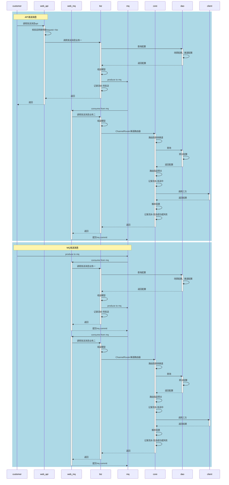

```mermaid
sequenceDiagram

participant customer

participant web_api
participant web_mq

participant biz

participant mq

participant core

participant dao

participant client

# 通过API与其他系统交互
rect rgb(173 216 230)
note over customer,web_api: API发送消息
customer->>web_api: 调用发送消息api
activate web_api
web_api->>web_api: 校验且转换参数request->bo
web_api->>biz: 调用发送消息业务一
activate biz
biz->>dao: 查询配置
activate dao
dao->>dao: 场景配置、渠道配置
dao-->>biz: 返回配置
deactivate dao
biz->> biz: 组装模型
biz-xmq: produce to mq
biz->>biz: 记录流水-待发送
biz-->>web_api: 返回 
deactivate biz
web_api-->>customer: 返回
deactivate web_api

mq->>web_mq: consume from mq
activate web_mq
web_mq->>biz: 调用发送消息业务二
activate biz
biz->>biz: 组装模型
biz->>core: ChannelRouter渠道路由器
activate core
core->>core: 路由到具体渠道
core->>dao: 查询
activate dao
dao->>dao: 网关配置
dao-->>core: 返回配置
deactivate dao
core->>core: 路由指定网关
core->>core: 记录流水-发送中
core->>client: 调用三方
activate client
client-->>core: 返回结果
deactivate client
core->>core: 解析结果
core->>core: 记录流水-发送成功或失败
core-->>biz: 返回
deactivate core
biz-->>web_mq: 返回
deactivate biz
web_mq-->>mq: 提交mq commit
deactivate web_mq
end

# 通过MQ与其他系统交互 
rect rgb(173 216 230)
note over customer,mq: MQ发送消息
customer-xmq: produce to mq
mq->>web_mq: consume from mq
activate web_mq
web_mq->>biz: 调用发送消息业务一
activate biz
biz->>dao: 查询配置
activate dao
dao->>dao: 场景配置、渠道配置
dao-->>biz: 返回配置
deactivate dao
biz->> biz: 组装模型
biz-xmq: produce to mq
biz->>biz: 记录流水-待发送
biz-->>web_mq: 返回
deactivate biz
web_mq-->>mq: 提交mq commit
deactivate web_mq

mq->>web_mq: consume from mq
activate web_mq
web_mq->>biz: 调用发送消息业务二
activate biz
biz->>biz: 组装模型
biz->>core: ChannelRouter渠道路由器
activate core
core->>core: 路由到具体渠道
core->>dao: 查询
activate dao
dao->>dao: 网关配置
dao-->>core: 返回配置
deactivate dao
core->>core: 路由指定网关
core->>core: 记录流水-发送中
core->>client: 调用三方
activate client
client-->>core: 返回结果
deactivate client
core->>core: 解析结果
core->>core: 记录流水-发送成功或失败
core-->>biz: 返回
deactivate core
biz-->>web_mq: 返回
deactivate biz
web_mq-->>mq: 提交mq commit
deactivate web_mq
end


```

