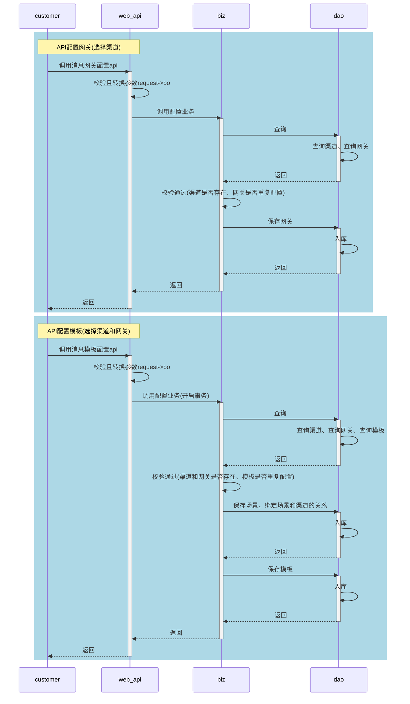

```mermaid
sequenceDiagram
participant customer
participant web_api
participant biz
participant dao

# 配置网关
rect rgb(173 216 230)
note over customer,web_api: API配置网关(选择渠道)
customer->>web_api: 调用消息网关配置api
activate web_api
web_api->>web_api: 校验且转换参数request->bo
web_api->>biz: 调用配置业务
activate biz
biz->>dao: 查询
activate dao
dao->>dao: 查询渠道、查询网关
dao-->>biz: 返回
deactivate dao
biz->>biz: 校验通过(渠道是否存在、网关是否重复配置)
biz->>dao: 保存网关
activate dao
dao->>dao: 入库
dao-->>biz: 返回
deactivate dao
biz-->>web_api: 返回
deactivate biz
web_api-->>customer: 返回
deactivate web_api
end

# 配置消息模板
rect rgb(173 216 230)
note over customer,web_api: API配置模板(选择渠道和网关)
customer->>web_api: 调用消息模板配置api
activate web_api
web_api->>web_api: 校验且转换参数request->bo
web_api->>biz: 调用配置业务(开启事务)
activate biz
biz->>dao: 查询
activate dao
dao->>dao: 查询渠道、查询网关、查询模板
dao-->>biz: 返回
deactivate dao
biz->>biz: 校验通过(渠道和网关是否存在、模板是否重复配置)
biz->>dao: 保存场景，绑定场景和渠道的关系
activate dao
dao->>dao: 入库
dao-->>biz: 返回
deactivate dao
biz->>dao: 保存模板
activate dao
dao->>dao: 入库
dao-->>biz: 返回
deactivate dao
biz-->>web_api: 返回
deactivate biz
web_api-->>customer: 返回
deactivate web_api
end
```

